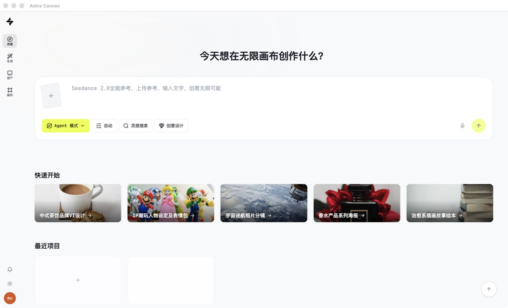
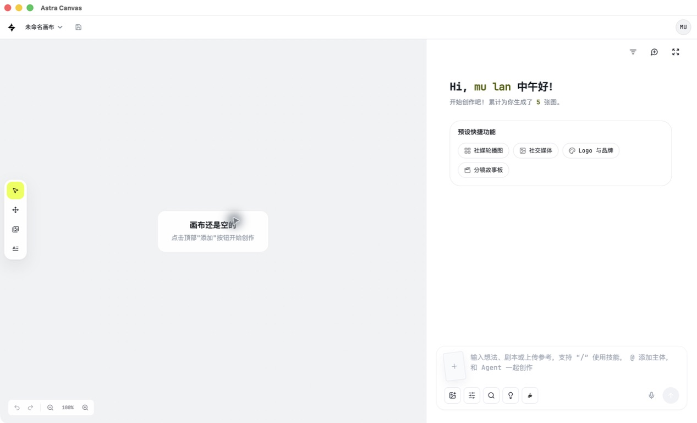
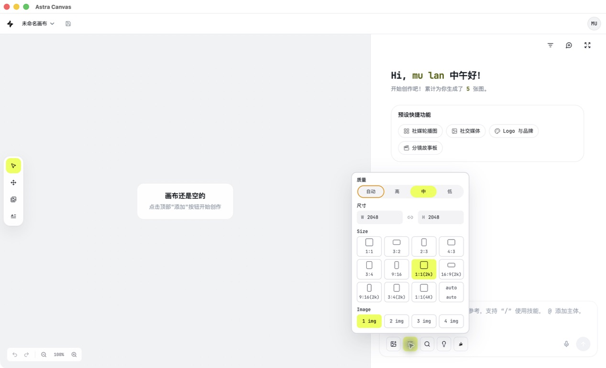

<p align="center">
  
</p>

# FrameLoom

[](https://github.com/lanmu1818-ship-it/frameloom/actions/workflows/ci.yml)

[Live Demo](https://ai.vip98k.com/demo-home) · [Website](https://ai.vip98k.com/) · [Model API Portal](https://api.vip98k.com/) · [App Preview](#app-preview)

**FrameLoom** is an open-source AI design workspace frontend for image and video canvases and node-based workflows. Its name combines *Frame* and *Loom*: weaving creative assets and workflows into finished work.

Built with **React, TypeScript, Vite, and Tailwind CSS**, this standalone frontend was extracted from an existing desktop app. It includes authentication screens, a creative workspace, image and video canvases, node editing, generation task panels, team interfaces, and an optional desktop bridge client.

**A compatible backend is required.** This repository contains the frontend; authentication, uploads, AI generation, team permissions, billing, and project storage must be provided by your own backend or a compatible API. Without a configured backend, the app opens a connection setup screen. It does not connect to the original commercial service by default.

## Model API Portal

Visit the [Model API Portal](https://api.vip98k.com/) to explore the hosted model API service. This is an external service; access and usage are subject to its account permissions and terms. The frontend still requires a compatible application backend as described in [Backend Integration](docs/backend-integration.md).

## App Preview

These screenshots were captured from the running desktop app on September 16, 2026. The website, live demo, and current desktop release still use the **Astra Canvas** name; **FrameLoom** is the name of this independent open-source frontend. Features, assets, and backend configuration in the hosted service and desktop release may differ from this repository.

### Home

Start with a creative prompt, use Agent mode, explore quick starts, and revisit recent projects.



### Canvas Workspace

An infinite canvas with selection and pan tools, an Agent conversation panel, and creative shortcuts.



### Generation Settings

Adjust image quality, aspect ratio, resolution, and output count directly from the canvas.



Screenshots illustrate the interface. Third-party assets and brands shown retain their respective rights; the original media files are not bundled as app resources. See [Third-Party Notices](THIRD_PARTY_NOTICES.md). The demo home page is publicly accessible; generation, assets, and canvas operations require sign-in and are subject to the hosted service's permissions.

## Quick Start

Requires Node.js 20.19+ (or Node.js 22.12+) and pnpm 9.12.3.

```bash
git clone https://github.com/lanmu1818-ship-it/frameloom.git
cd frameloom
corepack enable
corepack prepare pnpm@9.12.3 --activate
pnpm install --frozen-lockfile
pnpm dev
```

Open the local URL printed in your terminal (default: `http://localhost:5173`) and enter your backend URL. Alternatively, configure it before starting the app:

```bash
cp .env.example .env.local
# Edit .env.local: VITE_API_BASE_URL=http://localhost:3000
pnpm dev
```

Use the backend's root URL without an `/api` suffix. Use HTTPS for remote deployments. A URL saved in the setup screen takes precedence over build-time configuration. To switch backends, clear this site's `yedir.apiBaseUrl` and other `yedir.*` configuration entries in your browser's developer tools, then reload.

`VITE_*` values are included in the browser bundle and are public. Never put database passwords, model provider keys, storage credentials, or server signing secrets in them.

## Build and Validate

```bash
pnpm check:public
pnpm test
pnpm typecheck
pnpm build
pnpm preview
```

Build output is written to `dist/`. `index.html` is the full workspace entry; `canvas.html` is the canvas entry and requires an existing session with a compatible backend. Deploy static files at the domain root and route workspace requests back to `index.html`. For a canvas-only deployment, use the canvas entry as the site's default document and route fallback. See the [Deployment Guide](docs/deployment.md).

## Source Structure

```text
src/desktop/       Browser entry points, lightweight routing, desktop bridge client
src/components/    Workspace, canvases, nodes, and generation panels
src/app-routes/    App page components
src/client/        API requests, uploads, downloads, and session helpers
src/runtime/       Public runtime configuration and local archive settings
src/lib/           Shared frontend logic, model capabilities, and UI configuration
src/providers/     Session, theme, upload, and other React providers
src/services/      Canvas service clients
src/store/         Client state
src/styles/        Global styles
types/             Public data types
public/            Original placeholder SVGs, neutral icons, and local help pages
```

Local adapters replace the original project's `next/link`, `next/navigation`, and `next/dynamic` imports. This version does not run a Next.js server and does not depend on the original repository or its `node_modules` directory.

## Features and Backend Requirements

| Feature | Included in this repository | Requires integration |
| --- | --- | --- |
| Workspace, canvases, nodes, and settings panels | React UI and state logic | Project data APIs |
| Sign-in, registration, and third-party authentication | Frontend flows | Sessions, email, Clerk configuration, and callback services |
| Image/video generation and editing | Requests and task display | Model gateway, queues, authentication, and quotas |
| Uploads, downloads, and persistence | Client implementations | Storage and signed URL services |
| Team management | User-facing interfaces | Server-side role and permission checks |
| Local archives and automatic updates | Bridge interfaces | Electron/Tauri shell implementation |

A successful frontend build does not implement these backend services. Demo photos, third-party video/audio samples, and original branding in app resources have been replaced with original placeholder SVGs or left empty. Documentation screenshots retain the actual interface for preview. Audio and video demo URLs are empty; configure assets you have permission to use.

## Documentation

The following supporting documents are currently available in Chinese:

- [Backend Integration](docs/backend-integration.md) and [API Path Index](docs/api-paths.md)
- [Open-Source Preparation Notes](docs/open-source-cleanup.md)
- [Contributing](CONTRIBUTING.md) and [Security Policy](SECURITY.md)
- [Third-Party Notices](THIRD_PARTY_NOTICES.md)

## License

This project retains the original project's Apache-2.0 license. See [LICENSE](LICENSE) for the full text and [NOTICE](NOTICE) for preserved upstream copyright notices. Dependencies retain their respective licenses. References to projects or providers do not imply affiliation or endorsement.
